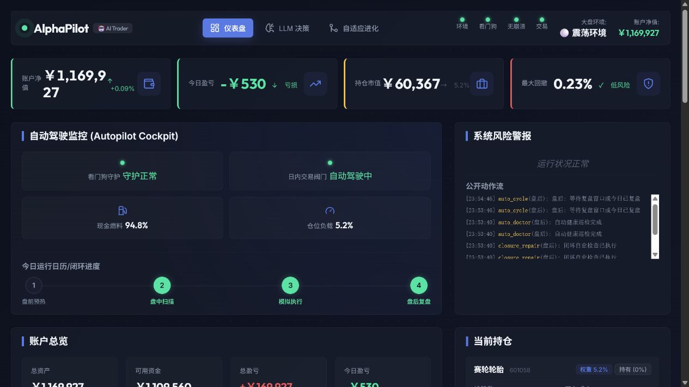

# AlphaPilot

[中文](README.md) | [English](README.en.md)

## 快速入口

- **5 分钟跑起来**：[快速开始](#快速开始)
- **看真实驾驶舱**：[在线驾驶舱](#在线驾驶舱)
- **让 AI 来驾驶**：[AI 驾驶员 Skill](#ai-驾驶员-skill)
- **部署到 Linux/Hermes**：[Linux / Hermes 无人值守模式](#linux--hermes-无人值守模式)
- **公开网站怎么保护**：[公网 Web 安全模型](#公网-web-安全模型)
- **本地验证命令**：[测试](#测试)
- **使用文档**：[本地演示](docs/demo.md) / [AI 驾驶员指南](docs/ai-driver-skill.md) / [部署到 Hermes](docs/hermes-github-actions-deploy.md)

面向 A 股的自愈式 AI 模拟盘交易驾驶舱。

AlphaPilot 把 A 股模拟盘系统改造成一辆可被 Agent 驾驶的交易赛车：
LLM 负责交易决策，Linux/Hermes Agent 可以无人值守驾驶，Watchdog 和 Doctor
负责监控与自愈，公网只读仪表盘展示驾驶舱状态，但不暴露控制动作。

> 仅用于研究、教育和模拟盘观察。AlphaPilot 不构成投资建议，不保证收益。
> 除非你完全理解风险，请保持 `BROKER_MODE=paper`。

## 项目为什么存在

大多数 AI 交易项目主要聚焦三类内容：Notebook、回测或 LLM Prompt。
AlphaPilot 更关注 AI 交易员周围的工程闭环：

- 盘前预热
- 盘中扫描和模拟执行
- 止损巡检
- 盘后复盘
- LLM 教训提取
- 自适应参数进化
- Watchdog 监控
- Doctor 自愈
- Linux `systemd --user` 无人值守运行
- 公网只读驾驶舱观测

项目目前对 A 股模拟盘有较强偏向，但整体架构也适合研究“由 Agent 操作的金融自动化系统”。

## 在线驾驶舱

公网只读仪表盘：

- <https://alphapilot.pp.ua>



公网仪表盘只用于观测。它不会暴露暂停、恢复、修复、Token 输入、原始环境变量或交易控制接口。

## 核心特性

- **LLM 交易决策**：支持 MiMo/Xiaomi 兼容 OpenAI 风格 API，用于决策推理和交易计划生成。
- **五维信号上下文**：技术面、资金面、舆情面、情绪面和基本面。
- **模拟账户引擎**：模拟现金、持仓、成交、手续费、盈亏和账户快照。
- **交易记忆**：盘后复盘和教训可以反馈到后续决策。
- **自适应进化**：当近期胜率或表现偏弱时，自动收紧下一轮阈值和仓位缩放。
- **Watchdog 与 Doctor**：检测循环停滞、过期状态、未决崩溃和闭环缺口。
- **Hermes/Linux 模式**：生成 `systemd --user` 任务，支持 Linux 无人值守运行。
- **公网安全层**：生产 Web 模式会脱敏内部路径、命令、Token、Traceback 和长 Prompt 式推理。
- **仪表盘优先的可观察性**：展示账户、持仓、风险状态、LLM 决策、策略参数、教训和心跳。

## 架构

```text
市场 / 数据源
  |-- 腾讯实时行情
  |-- 东方财富数据
  |-- LongBridge OpenAPI
  |-- Baostock / 历史数据兜底
          |
          v
信号与上下文层
  |-- 技术面 / 资金面 / 情绪面 / 舆情面 / 基本面
  |-- 市场环境
  |-- 交易记忆和教训
          |
          v
LLM Trader
  |-- 决策推理
  |-- 置信度
  |-- 交易计划
          |
          v
模拟执行与风控
  |-- 模拟订单
  |-- 止损 / 止盈
  |-- 回撤控制
          |
          v
运维闭环
  |-- 自动盯盘
  |-- Watchdog
  |-- Doctor
  |-- 每日复盘
          |
          v
Web 驾驶舱 / 报告 / 通知
```

## 仓库结构

```text
config.py                 全局配置
main.py                   CLI 入口
data/                     行情数据、数据库、快照
signals/                  信号计算
strategy/                 LLM 交易员、记忆、自适应参数
execution/                模拟账户和订单管理
risk/                     仓位、止损、回撤控制
review/                   每日复盘和 LLM 复盘
scheduler/                自动循环、Watchdog、Doctor、通知
web/                      FastAPI 服务和静态仪表盘
data/linux_tasks/         Linux/Hermes systemd user 任务模板
docs/                     架构与运维文档
tests/                    本地契约与回归测试
```

## 快速开始

下面这组命令适合第一次把车点火：创建虚拟环境、安装依赖、检查配置、跑一圈模拟驾驶，
最后打开本地驾驶舱。默认只跑模拟盘，不会触发真实交易。

```bash
git clone https://github.com/alfred1994/alpha-pilot.git
cd alpha-pilot

python3 -m venv .venv
. .venv/bin/activate
pip install -r requirements.txt

cp env.example .env
# 编辑 .env，并保持 BROKER_MODE=paper。

python3 main.py --health
python3 main.py --paper-ready --unattended-platform linux
python3 main.py --auto-once
python3 main.py --web --host 127.0.0.1 --port 8000
```

启动 Web 服务后打开：

<http://127.0.0.1:8000>

如果你只是想先看看座舱长什么样，可以直接访问公网只读驾驶舱：

<https://alphapilot.pp.ua>

## AI 驾驶员 Skill

AlphaPilot 不只是一个脚本集合，它更像一辆已经装好传感器、仪表盘、维修舱和安全阀的交易赛车。
LLM 负责判断路线，Watchdog 像赛道监控，Doctor 像维修技师，而 Hermes / Codex / Claude
这类 AI Agent 可以作为驾驶员接管日常巡航。

项目内置了一份可复制给其他 AI Agent 的驾驶员说明书：

- [`.agents/skills/pilot_driver/SKILL.md`](.agents/skills/pilot_driver/SKILL.md)
- [docs/ai-driver-skill.md](docs/ai-driver-skill.md)

最简单的使用方式：

1. 把 `.agents/skills/pilot_driver/SKILL.md` 交给你的 AI Agent。
2. 让 Agent 在服务器上的项目根目录执行 `python3 main.py --agent-status`。
3. 若 `watchdog.ok=false`，让 Agent 先跑 `python3 main.py --doctor`，再复查状态。
4. 若发现崩溃，按 Skill 中的“进站维修流程”读取 `--crash-info`、修复、测试、`--resolve-crash`、重启服务。
5. 让 Agent 每次操作后汇报“现在是否在跑、为什么没交易、下一步需要什么”。

一句话：人负责定目标和看结果，AI 驾驶员负责盯盘、巡检、诊断和把车重新开回赛道。

## 重要环境变量

```bash
# LongBridge 行情数据
LONGPORT_APP_KEY=
LONGPORT_APP_SECRET=
LONGPORT_ACCESS_TOKEN=

# LLM endpoint
XIAOMI_API_KEY=
XIAOMI_BASE_URL=https://token-plan-cn.xiaomimimo.com/v1

# 可选通知通道
TELEGRAM_BOT_TOKEN=
TELEGRAM_CHAT_ID=

# 除非你明确在开发 broker adapter，否则保持 paper。
BROKER_MODE=paper
```

完整模板见 [env.example](env.example)。

## 常用命令

```bash
python3 main.py --scan
python3 main.py --execute
python3 main.py --review
python3 main.py --stop-check
python3 main.py --health
python3 main.py --watchdog
python3 main.py --doctor
python3 main.py --ops-status
python3 main.py --agent-status
python3 main.py --ai-report
python3 main.py --auto-once
python3 main.py --auto
python3 main.py --auto-rehearse --rehearsal-days 5
python3 main.py --paper-ready --unattended-platform linux
python3 main.py --paper-bootstrap --unattended-platform linux --python-cmd python3
python3 main.py --linux-tasks
python3 main.py --linux-unattended-status
```

## Linux / Hermes 无人值守模式

AlphaPilot 可以生成 Linux `systemd --user` 任务：

```bash
python3 main.py --linux-tasks
bash data/linux_tasks/install_systemd_user.sh
systemctl --user status alpha-pilot-auto.service
```

完整部署说明见 [docs/hermes-github-actions-deploy.md](docs/hermes-github-actions-deploy.md)。

## 公网 Web 安全模型

生产模式下，FastAPI Web 服务会：

- 关闭 `/docs` 和 `/openapi.json`
- 通过 `/api/public/status` 提供仪表盘使用的只读状态
- 默认让 `/api/status` 返回脱敏快照
- 除非 `ALPHAPILOT_ENABLE_CONTROL_API=true`，否则不挂载 `/api/control/*`
- 添加基础浏览器安全响应头
- 隐藏内部路径、Shell 命令、Traceback、Token 类字符串和长 Prompt 式推理

推荐生产变量：

```bash
ALPHAPILOT_ENV=production
ALPHAPILOT_CORS_ORIGINS=https://your-dashboard-domain.example
BROKER_MODE=paper
```

## 测试

项目使用本地 Python 脚本作为契约测试：

```bash
python3 -m compileall -q web scheduler strategy execution data main.py config.py tests
python3 tests/test_web_public_dashboard.py
python3 tests/test_agent_driver_contract.py
python3 tests/test_auto_control.py
python3 tests/test_auto_watchdog.py
python3 tests/test_auto_doctor.py
python3 tests/test_auto_trader.py
python3 tests/test_paper_readiness.py
python3 tests/test_paper_bootstrap.py
```

更宽的测试取决于你的行情、LLM 和本地环境配置。

## 路线图

- 零密钥 sample/demo data 模式
- 更清晰的 broker adapter 接口
- 更确定性的 replay 报告
- 更完整的模拟盘公开 benchmark 叙事
- README 截图和 release artifact
- 本地驾驶舱 Docker Compose demo

## 和热门项目的区别

- 它不是 Lean 或 NautilusTrader 那样的通用生产级交易引擎。
- 它不是 FinRL 或 TradeMaster 那样的学术 RL 研究平台。
- 它也不只是 TradingAgents 那样的多 Agent Prompt 框架。
- 它是一个面向模拟盘的交易运维驾驶舱，设计目标是让 autonomous coding/ops agent 驾驶和维护。

## 贡献

项目公开后欢迎贡献。请先阅读 [CONTRIBUTING.md](CONTRIBUTING.md)、
[SECURITY.md](SECURITY.md) 和 [DISCLAIMER.md](DISCLAIMER.md)。

## 许可证

Apache-2.0。见 [LICENSE](LICENSE)。
